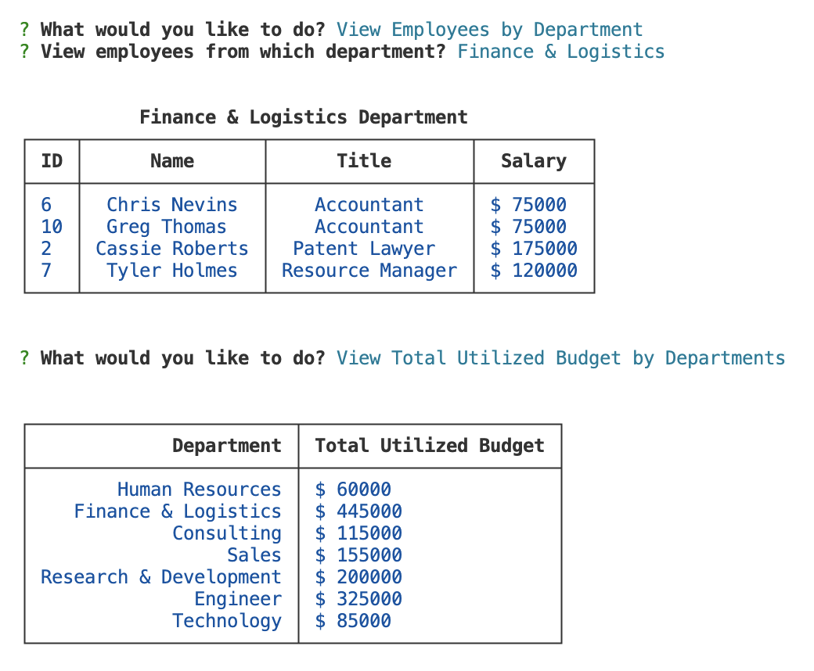

# Module 12 Challenge - Employee Tracker

>**Application Video:** [Employee Tracker](https://drive.google.com/file/d/1Jm_Htt42nQezbXmHlohiU36oCqxlxcAD/view)
>
>**View:** [Description](#description) / [Application Details](#application-details) / [Application Sample Functions](#application-sample-functions)
>
>**Application Preview:**
>
>
> 
>**Terminal Output Preview:**
>
>
> 
## **DESCRIPTION**
> Topic Assessed: **SQL** - **Node.js, MYSQL2, db.query, schema, seeds, mysql, etc.**
### **My Task**
*Employee Tracker* is a content management systems (CMS) that allows a user track and modify the employees of a company.
> Create the application from scratch.
> 
> Create package.json file detailing required dependencies to run the application.
> 
> Create index.js file to launch application file.
>
> Create server.js file that holds the sql database and server information/module.
>
> Organize directories in accordance with standard format (root, lib, db, assets).
>
> Create class called action that utilizes sub modules/classes.
>
> Create individual class for each action view, add, update, and remove.
>
> Create schema.sql, seeds.sql, and query.sql files in db to assist in the development process.
>
> Use external packages such as mysql2, express, inquirer, and console-table-printer.
> 
> **Note**: Used [console-table-printer](https://www.npmjs.com/package/console-table-printer) instead of [console.table](https://www.npmjs.com/package/console.table)
>
> Completed all **Bonuses** for the application: `Update employee managers`, `View employees by manager`, `View employees by department`, `Delete departments, roles, and employees`, and `View the total utilized budget of a department`.
>
## User Story
```
AS A business owner
I WANT to be able to view and manage the departments, roles, and employees in my company
SO THAT I can organize and plan my business
```
## Acceptance Criteria
```
GIVEN a command-line application that accepts user input
GIVEN a command-line application that accepts user input
WHEN I start the application
THEN I am presented with the following options: view all departments, view all roles, view all employees, add a department, add a role, add an employee, and update an employee role
WHEN I choose to view all departments
THEN I am presented with a formatted table showing department names and department ids
WHEN I choose to view all roles
THEN I am presented with the job title, role id, the department that role belongs to, and the salary for that role
WHEN I choose to view all employees
THEN I am presented with a formatted table showing employee data, including employee ids, first names, last names, job titles, departments, salaries, and managers that the employees report to
WHEN I choose to add a department
THEN I am prompted to enter the name of the department and that department is added to the database
WHEN I choose to add a role
THEN I am prompted to enter the name, salary, and department for the role and that role is added to the database
WHEN I choose to add an employee
THEN I am prompted to enter the employee’s first name, last name, role, and manager, and that employee is added to the database
WHEN I choose to update an employee role
THEN I am prompted to select an employee to update and their new role and this information is updated in the database 
```

## **APPLICATION DETAILS**

### index.js Information
* **require**: Define packages needed for the application.
* **action**: Call the module and function to initialize the application.

### server.js Information
* **require**: Define packages needed for the application.
  * `express` and `mysql2`.
* **PORT**: Define the local server port to be 3001.
* **db**: Define and lauch connection to the sql database.
  * Includes database information (host, user, password, database).
* **module.exports**: Export the server to be used by other modules.

### action.js Information
* **require**: Define packages needed for the application.
  * `inquirer` and `console-table-printer`
  * all action modules: `view`, `add`, `update`, and `remove`
* **module.exports**: Export the class.

### add.js Information
* **require**: Define packages needed for the application.
  * `db` from the `server.js` module
  * `inquirer`
* **module.exports**: Export the class.

### remove.js Information
* **require**: Define packages needed for the application.
  * `db` from the `server.js` module
  * `inquirer`
* **module.exports**: Export the class.

### update.test.js Information
* **require**: Define packages needed for the application.
  * `db` from the `server.js` module
  * `inquirer`
* **module.exports**: Export the class.

### view.js Information
* **require**: Define packages needed for the application.
  * `db` from the `server.js` module
  * `inquirer` and `console-table-printer`
* **module.exports**: Export the class.

### db Information
* **schema.sql**: Resets the database.
  * Removes existing database and creates new `employeeTracker_db`.
  * Sets as active database.
  * Creates tables `departments`, `roles`, and `employees`.
  * Define each table schema based on required fields.
  * Links foreign key and references respective tables.
  * Each table has an auto incremented `id` that is defined as the `PRIMARY KEY`.
* **seeds.sql**: Inserts dummy values into the database for testing purposes.
* **query.sql**: Sample db queries to run for testing.
  * `SELECT`, `FROM`, `LEFT JOIN`, `OUTER JOIN`, `SUM`, `GROUP BY`, etc.

### package.json Information
* **package**: Define the dependencies/packages used in the application.
  * Dependencies: `console-table-printer`, version ^2.11.1
  * Dependencies: `express`, version ^4.17.1
  * Dependencies: `inquirer`, version 8.2.4
  * Dependencies: `mysql2`, version ^2.2.5

## **APPLICATION SAMPLE FUNCTIONS**
### Sample Functions
>
>
>
>